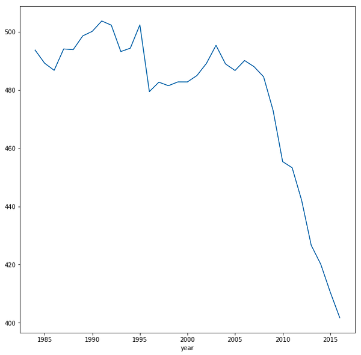

# Contamination-data-Analysis_machine-learning-XGBRboost

## Summary

- [ Data Analysis ](#an)
  * [ 1. Description ](#decr)
  * [ 2. Objective ](#obj)
  * [ 3. Initial processing ](#int)
  * [ 4. Quality assurance ](#qa)
    +[ 4.1 Duplicated values ](#dup)
    +[ 4.2 Non existent values (NAN) ](#nan)
    +[ 4.3 Outliers ](#out)
  * [ 5. Grouping variables ](#gv)
  * [  6. Variables distribution ](#vd)
    +[ 6.1 Numerical variables ](#num)
    +[ 6.2 Categorical variables ](#cat)
  * [  7. Comparisons ](#comp)
  * [  8. Conclusions of the analysis ](#conc)
    
- [ Workflow Overview ](#workf)

## Data Analysis

&nbsp;

### 1. Description

&nbsp;

The dataset consists of information regarding vehicles sold in the USA since 1985. This information includes technical details (displacement, type of transmission) and environmental details (gasoline consumption, CO2 emissions).

The original file is at [here](https://www.fueleconomy.gov/feg/epadata/vehicles.csv.zip)

The file I am going to use is a modified version (with fewer columns) because of the capacity of my computer to process such amount of data

Description of the Original dataset is [here](http://www.fueleconomy.gov/feg/ws/index.shtml#ft7)

&nbsp;

### 2. Objective

&nbsp;

The objective of this phase is to carry out an exploratory analysis in the data to identify the possible patterns and trends and their insights
Nowadays there is no standard process when making an Exploratory Data Analysis, I am going to follow this guide [link](http://blog.districtdatalabs.com/data-exploration-with-python-1)

The first thing to think before proceeding with the analysis is what the dataset is for or what information it contains. Going to your website I read that EPA has created this dataset to control how much the cars pollute, that data is registered in the dataset as variable 'co2'.

&nbsp;

### 3. Initial processing
[Code for this section](Analisys/Exploratory%20Data%20Analysis-%201.Initial%20processing.ipynb)

&nbsp;

To start the analysis I start using the pandas_profiling library that gives me an overview of the dataset being able to see the variables of the dataset, non-existent values ​​and also shows the coefficient of pearson, showing in a heat map the correlation between variables.

&nbsp;

### 4. Quality assurance (QA)
[Code for this section](Analisys/Exploratory%20Data%20Analysis-%202.%20%20Quality%20assurance%20(QA).ipynb)

&nbsp;

#### 4.1 Duplicated values

&nbsp;

In this section I will review the dataset. The objective will be to have a dataset as similar to the original but without errors in it that could lead us to draw wrong conclusions.

&nbsp;

The input of this step is the output of the previous.  In this section I try to see two things:

1. Make sure that data that should not be duplicated is not (for example, telephone numbers)

2. Check for columns that have a high number of duplicates, as they may not provide much information.

&nbsp;

The possible entities are:   

- manufacturer

- manufacturer-model

- manufacturer-model-year

- manufacturer-year

&nbsp;

 
Of these entities, the only ones that should not repeat specific cars, that is, manufacturer + model + year.

After the analysis of the duplicated values I found 1506 duplicate records, I eliminate them for the rest of the analysis because they can distort the conclusions. Now i need to see if there are variables in which there are a large number of records that have the same value (cardinality).

I see that the fields traccion, transmission, cilindros y combustible can have a problem of repeated values, in reality 30% is not very dramatic, it would be different if the most common value had 90%.

As can be seen this makes sense, since the vast majority of vehicles have two-wheel drive, either front or rear.

In this case, someone with domain knowledge might realize that 2-Wheel Drive is probably just a different classification of Front or Rear.
[link](https://www.edmunds.com/car-technology/what-wheel-drive.html)

although transmission has a relatively high cardinality, it actually shows a distribution of types, with two major classes.

The column `combustible`  can have a problem having 65% of the cases petrol `Regular`.

&nbsp;

#### 4.2 Non existent values (NAN)

&nbsp;

With everything calculated in the previous sections I can calculate how much energy a wind turbine can generate given some meteorological variables.
Once the calculation of how much the wind turbine generated above was generated, I made a comparison obtaining the following results:

As can be seen that field `traction, cylinders and transmission` have nonexistent values. However, they are negligible amounts (which has more is  'traccion' variable with 3% of nonexistent values)

&nbsp;

#### 4.3 Outliers

&nbsp;

To detect extreme values, a general measure is to consider outliers those values with a Z score (z score) greater than 3, that is, they move 3 times or more standard deviations away from the average.
The z score is defined as:

Consumption and co2 have outliers, to see them better I do a boxplot:

As can be seen that in terms of consumption there are some cars that pollute more than normal and others that pollute less than normal, we also see that there are cars that do not contaminate anything!
Is it possible that there are cars that do not use gasoline in the dataset. After analalyze the combustible unique values I can see that  in this dataset there are hybrid vehicles and pure electric vehicles. Since the objective is pollution, it would be advisable to remove at least those vehicles that do not pollute!

&nbsp;

##### Concluion of QA section

- There are 1506 duplicate records (we have removed them)

- The variables `displacement, cylinders, transmission and traction have non-existent values`

- The variable `fuel` has a dominant class (65% of cars have` Regular` fuel)

- There is an outlier in the variables `co2` and` consumption`

- There are hybrid cars and electric cars (we have removed the latter as they do not pollute).

&nbsp;

### 5. Grouping variables
[Code for this section](Analisys/Exploratory%20Data%20Analysis-%203.%20%20grouping%20%20variables.ipynb)

&nbsp;

In this section I will make certain groupings in the categorical variables that can be added in more generic types. The reason for doing this is that it helps to analate groups instead of individual elements.
For this it can be seen the number of different values that each category variable has:

A simple way to convert continuous variables into other categories is through the use of quintiles.
When I see the first rows I see something that seems strange to me. I see that type_consumption and type_co2 are negatively correlated. That is, for each car, those with a low consumption have a high CO2 and vice versa. Without being an expert in cars, logic would tell me the opposite, that is to say, those cars that consume the most gasoline are those that pollute the most.
At this time it is best to visualize the relationship of these variables and see how they are related. This is an example of how EDA is not a linear process.
In the description of the dataset, it is seen that CO2 is measured in grams per mile, while consumption is measured in miles per gallon.
I have to convert the consumption to gallons per mile and so both variables are relative to the mile and I can compare them.

&nbsp;

### 6. Variables distribution
[Code for this section](Analisys/Exploratory%20Data%20Analysis-%20%204.%20Variable%20distribution.ipynb)

&nbsp;

In this section I am going to analyze the distribution of the numerical variables andcategorical variables. 

#### 6.1 Numerical variables

&nbsp;

It seems that a large part of the variables follow a normal distribution. That the variables follow a normal distribution is important since many algorithms assume that the distribution of the variables is normal.
We can check this with a [probability graph]. The function of scipy.stats `probplot` compares the distribution of a variable with a theoretical distribution (the default normal), the more the graph looks like a 45-degree line the more normal it will be.
It seems that they follow a normal distribution, nevertheless, it is advisable to make sure doing a normality test. In a normality test, we want to reject the null hypothesis that the variable to be analyzed has been obtained from a population that follows a normal distribution.
For a confidence level of 95%, we reject the null hypothesis if the p-value is less than 0.05. That is, if a P value (p-value) less than 0.05 is obtained, it means that the probabilities that the null hypothesis is true is so low (less than 5%) that we reject it.
Scipy has the function [normaltest] that returns the p-value.
None of the numeric variables follow a correct normal distribution.

#### 6.2 Categorical variables

&nbsp;

One way to see how the categorical variables are distributed is through the `pandas.value_counts` function. This function returns the number of existing records for each value of a column.

&nbsp;

##### Conclusions for this sections

- No numerical variable follows a normal distribution.

- The numerical cylinder variable has an unbalanced distribution of discrete values ​​(displacement of 2 and 4 and 8 add up to 95% of the vehicles). It could be grouped as a categorical variable (2, 4, 8 and another).

- The manufacturer with the largest number of models is Chevrolet (10% of the total)

- 65% of the vehicles use normal gasoline

- The distribution of motor and consumption sizes and co2 is balanced throughout the range

- 70% of the vehicles use two-wheel drive

- Two thirds of cars have automatic transmission

- The majority class of vehicles is that of small cars (35% of the total)

- The largest manufacturers in terms of vehicles analyzed are the Americans. This makes sense because the EPA is the American agency and is probably the one that is most interested in studying US cars.

### 7. Comparisons
[Code for this section](Analisys/Exploratory%20Data%20Analysis-%205%20Comparisons.ipynb)

&nbsp;

In this section I will compare the variables between them to see what conclusions I can extract.
To start I can create an interactive heat map which I can vary to see the correlation between the variables.

Conclusions extracted of this heat map

- There are more low-consumption two-wheel vehicles than 4-wheel drive

- Manufacturers concentrate more on small / low consumption motor vehicles and very large / high consumption engine

- Most cars have automatic transmission, with small cars having similar values ​​of automatic and manual cars

- There are a number of trucks that are more polluting than any other type of car

&nbsp;

In this particular dataset, I have a temporary variable `year`. To which we take a look in a previous section but that should be observed again. We can consider it an ordinal variable (since it is not a continuous variable).
For which it makes sense to see evolution. For this, line graphics are ideal.

In general, the emission of CO2 has been reduced considerably over time.  Historically the displacement (and displacement) has been increasing. in manufactured vehicles, but as of 2010 this trend is reversed. both variables are linearly related.

&nbsp;

### 8.Conclusions of the analysis

&nbsp;

##### Description

The dataset consists of information relating to vehicles sold in the USA since 1985. This information includes technical details (displacement, type of transmission) and environmental details (gasoline consumption, CO2 emissions)

&nbsp;

##### QA

- The variables displacement, cylinders, transmission and traction have nonexistent values

- There is an outlier in the variables `co2` and` consumption`

- There are hybrid cars and electric cars (we have removed the latter as they do not pollute).

- The variable `consumption` is defined in miles per gallon and the variable` co2` is defined as grams per mile. Since co2 is the main variable of the dataset, we have created the variable consumption_litros_milla` defined as liters per mile to be able to compare with `co2

&nbsp;

##### Distribution of variables

- No numerical variable follows a normal distribution

- The numerical variable `cylinders` has an unbalanced distribution of discrete values ​​(displacement of 2 and 4 and 8 add up to 95% of the vehicles). It could be grouped as a categorical variable (2, 4, 8 and another)

- The manufacturer with the largest number of models is Chevrolet (10% of the total)

- 65% of the vehicles use normal gasoline

- The distribution of motor and consumption sizes and co2 is balanced throughout the range

- 70% of the vehicles use two-wheel drive

- Two thirds of cars have automatic transmission

- The majority class of vehicles is that of small cars (35% of the total)

- There are linear relationships between cylinders / displacement and co2 / consumption_litros_milla

&nbsp;

##### Comparisons

- There are more low-consumption two-wheel vehicles than 4-wheel drive

- Manufacturers concentrate more on small / low consumption motor vehicles and very large / high consumption engine

- Most cars have automatic transmission, with small cars having similar values ​​of automatic and manual cars

- There are a number of trucks that are more polluting than any other type of car

- Vehicles with automatic transmission have slightly higher CO2 and consumption values

- Vans and vans have the highest consumption (around 0.25 liters / mile). On the other hand, family and small cars have the lowest gasoline consumption (~ 0.15 liters / mile)

- The values of co2 are similar regardless of the type of gasoline used

- Premium gas trucks consume 38% more than small vehicles that use the same type of gasoline

- The consumption and emission of CO2 have been falling continuously since 1985

- Historically it has been increasing the displacement in manufactured vehicles, but as of 2010 this trend is reversed

